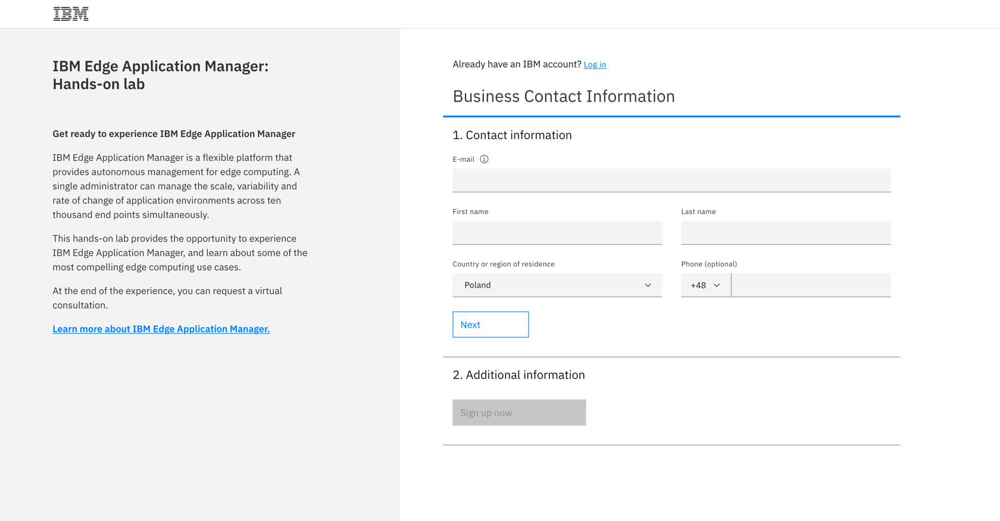
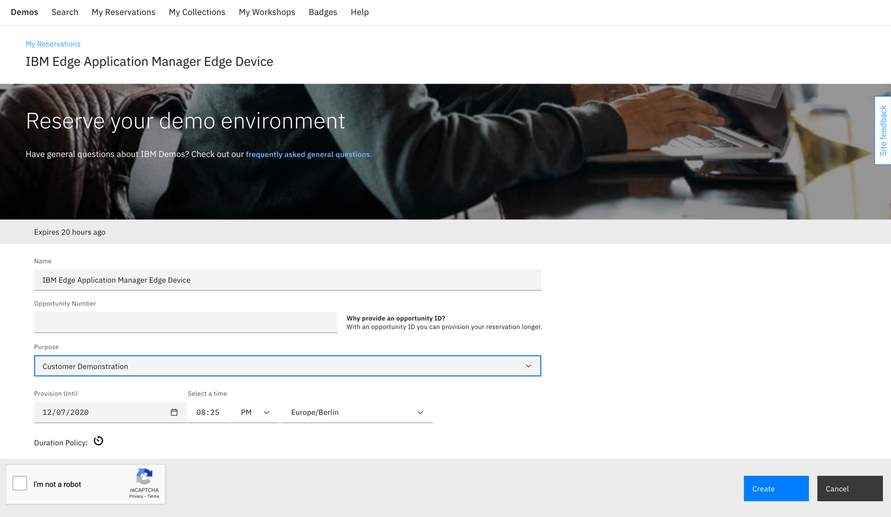
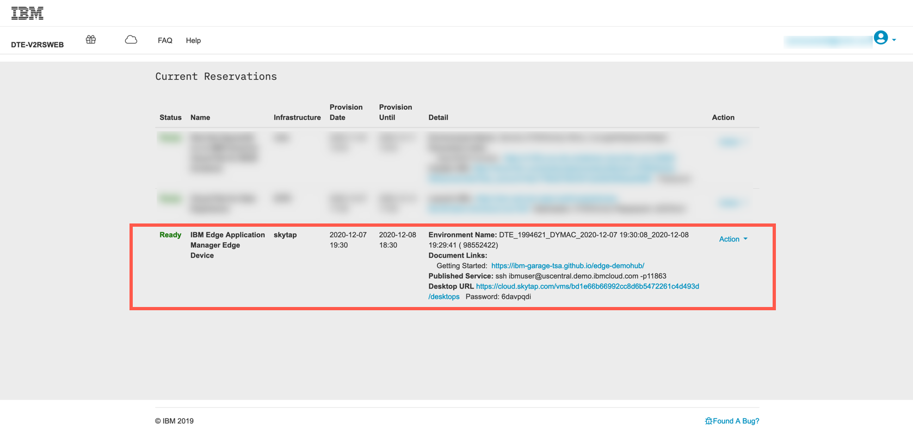

## Requesting Trial instance

An instance of IBM Edge Application Manager along with a simulated edge device (Ubuntu VM) can be provisioned from IBM website at this link: [Start your trial experience](https://www.ibm.com/account/reg/signup?formid=urx-43769)

   

1. Select **country/region**, validity date and Submit.

   

   or

   

2. The reservation status is shown in the next screen if there is an available cluster from the pool for immediate use. Otherwise, an email notification will be sent when the Trial instance is ready. Expect to see 2 mails (one for for IEAM Hub instance and one for a simulated device)

   

   Now you are ready to move to the next step and get a hands-on experience with IBM Edge Application Manager!
