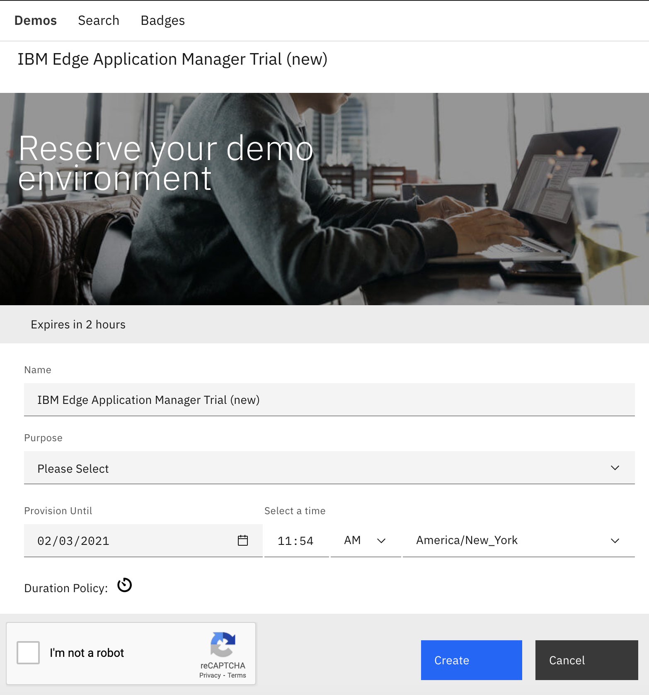
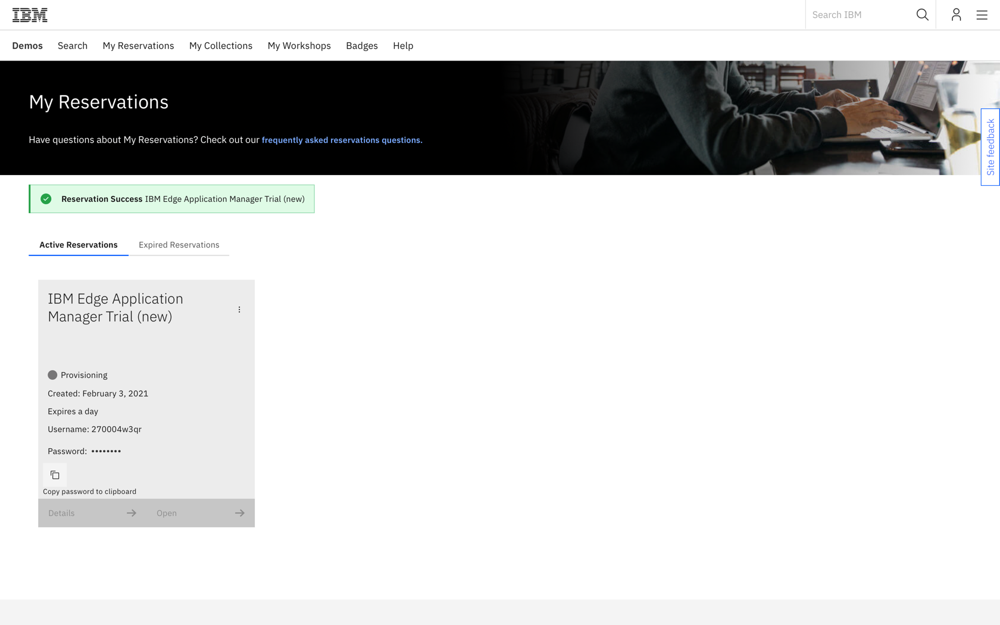
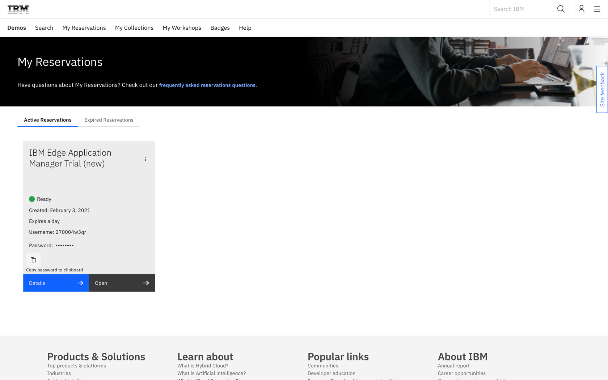

## Requesting Trial instance

   An instance of IBM Edge Application Manager along with a simulated edge device (Ubuntu VM) can be provisioned from IBM website at this link: [Start your trial experience](https://www.ibm.com/demos/new-reservation/e404d96375f442aa182a49b55b1b04a6/). To request a Trial you have to login with the IBMid. Create one if you don't have one.

   1. Provide the reservation details and click Create.

      

   2. During Trial provisioning you can see the following screen.

      

   3. After a few minutes (you mau need to refresh the page) the status is changed to **Ready** as shown below.

   

   4. There is also an e-mail sent to the address that you provided for IBMid registration. E-mail contains the same reservation details which you can get clicking **Details** button. Sample e-mail is shown below.

      

   Now you are ready to move to the next step and get a hands-on experience with IBM Edge Application Manager!
