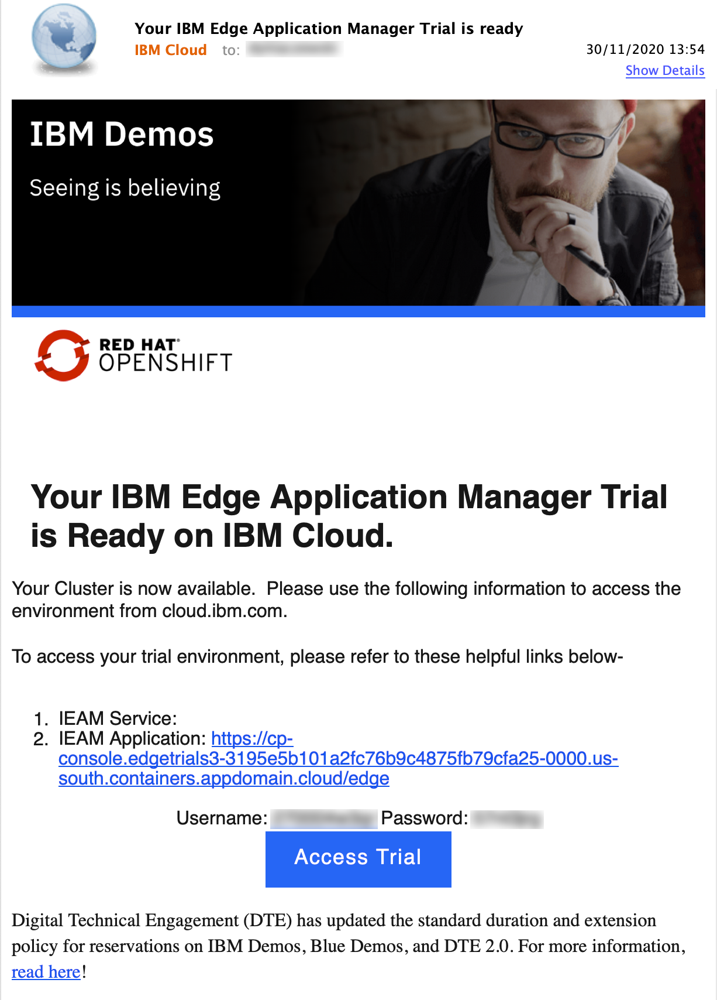
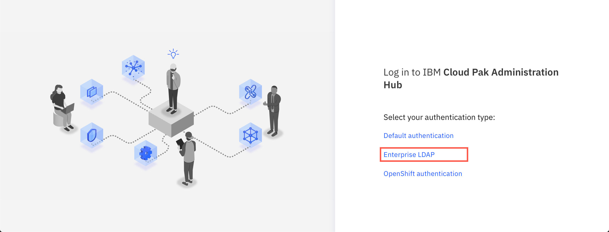
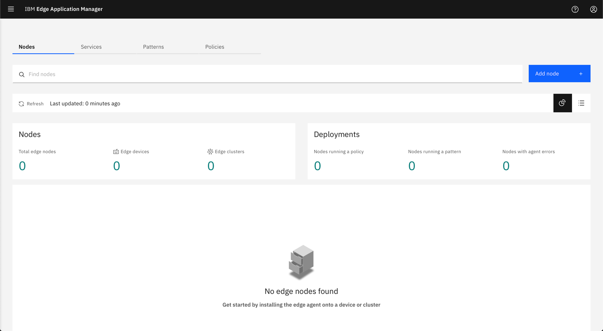
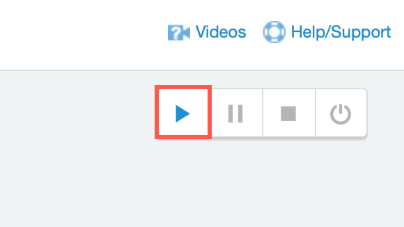
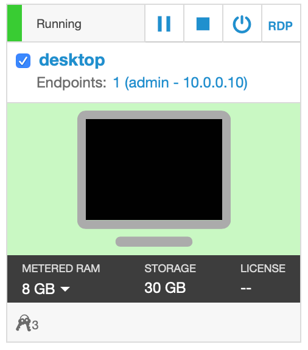
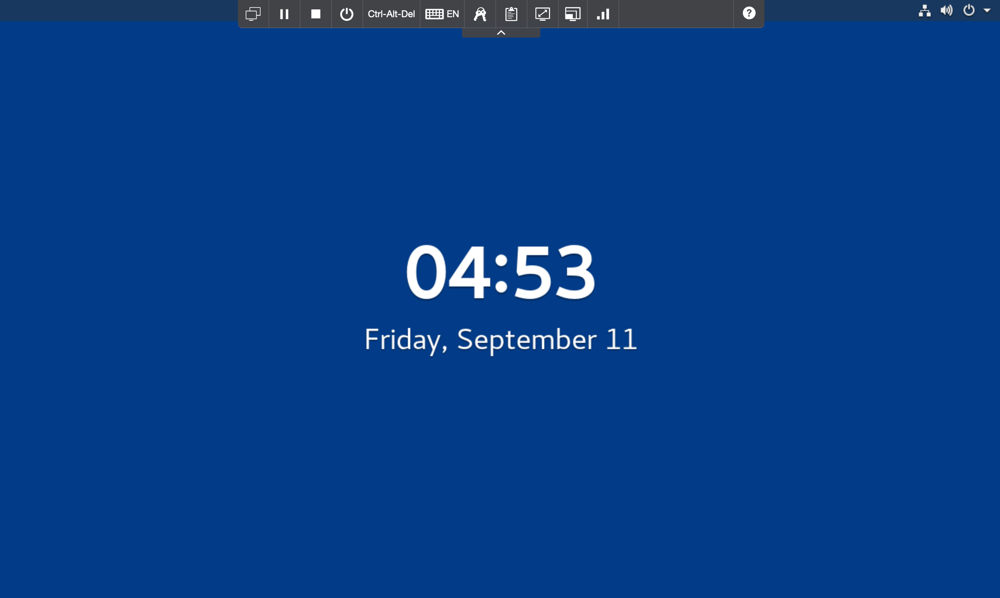
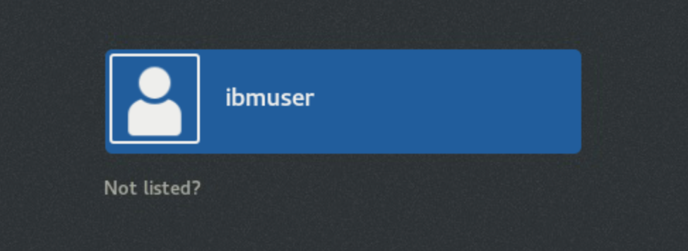
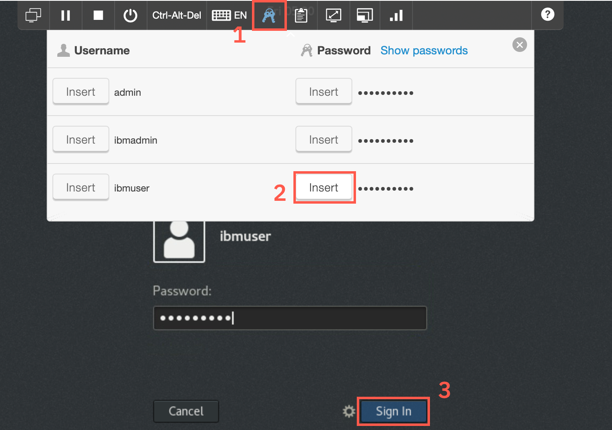
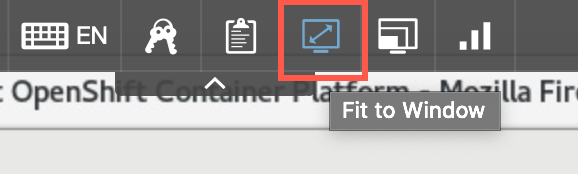
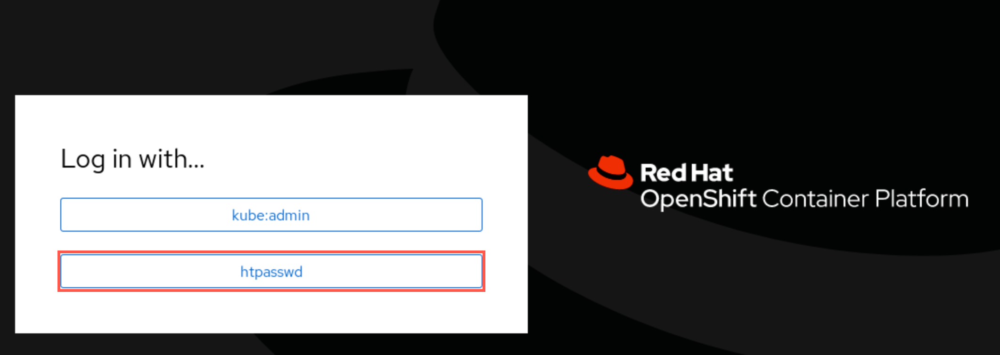

<FeatureCard
  title="Getting Started with IBM Edge Application Manager Trial"
  color="dark"
  >

</FeatureCard>

***

This tutorial as well as other linked ones were designed to run using the following environment: [LINK_PLACEHOLDER](https://www.ibm.com/cloud/edge-application-manager/get-started)
## Accessing the Trial environment

When the Trial environment is provisioned you should receive the e-mail with link and access credentials as shown below.

There are two elements of the Trial environment:

- instance of the IBM Edge Application Manager running on IBM Cloud
- sample virtual machine simulating the edge device

Open the provided link and you should see the following screen (The Trial envionment is currently using self-signed certificates so accept any warnings and cotinue accessing the website)

Click the **Entrprise LDAP** option and login with the credentials from your e-mail.

Upon successful login, you should see the home screen of the IBM Edge Application Manager

***

## Accessing and starting a simulated edge device

As a part of the Trial experience you are provided with the sample simulated edge device. In case you do not have any real edge devices you can access the provided virtual machine and follow the tutorials.

Start the environment with the Play button in the top-right corner

It takes about 2-3 minutes for the virtual machine to start

  Click the screen representing the virtual machine

  

  You should see the following screen

  

  Click on the screen or hit enter key, then select the **ibmuser**

  

  You can type in password **engageibm** or insert the stored credentials as shown below

  

  You can resize the virtual desktop with the **Fit to window** button

  

  Upon login the browser should start automatically, loading the Openshift console.

  Select **htpasswd**

  

  User **ibmadmin** with the password should be pre-populated for you. Click **Login**

  