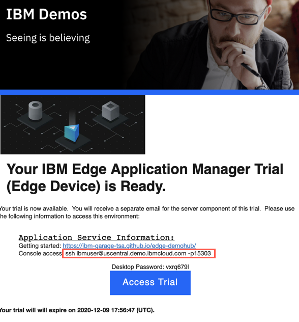
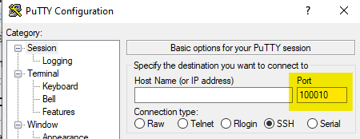

<FeatureCard
  title="Getting Started with IBM Edge Application Manager Trial"
  color="dark"
  >


</FeatureCard>

***

  To get started, you need the IBM Edge Application Manager Trial environment. To request one, follow the instructions here: [Requesting the Trial](../environment/requesting/index.mdx)

  ## Accessing the Trial environment

  There are two elements of the Trial environment:

  - instance of the IBM Edge Application Manager running on IBM Cloud (Management Hub)
  - sample virtual machine simulating the edge device (Edge node)

  When the Trial environment is provisioned you should receive the two e-mails with links and access credentials as shown below.

  - Edge node reservation e-mail

  

  - Management hub reservation e-mail

  

## Accessing the IBM Edge Application Manager instance

  Open the provided link and you should see the following screen (The Trial envionment is currently using self-signed certificates so accept any warnings and cotinue accessing the website)

  

  Click the **Entrprise LDAP** option and login with the credentials from your e-mail.

  Upon successful login, you should see the home screen of the IBM Edge Application Manager

  

***

## Accessing and starting a simulated edge device

  As a part of the Trial experience you are provided with the sample simulated edge device. In case you do not have any real edge devices you can access the provided virtual machine and follow the tutorials.

  Start the environment with the Play button in the top-right corner

  

  It takes about 2-3 minutes for the virtual machine to start


  To access the simulated edge device (the provided Ubuntu VM) you need a terminal with SSH client. On Mac or Linux workstation use a regular terminal, on Windows use Putty

  <span style="color:red">**IT IS NOT RECOMMENDED TO USE SKYTAP UI TO CONNECT TO THE MACHINE - YOU WILL USE A TERMINAL CONNECTION DIRECTLY FROM YOUR WORKSTATION**</span>

  Copy the **ssh** command provided in the reservation confirmation mail. 

  

  In above example, it is **ssh ibmuser@uscentral.demo.ibmcloud.com -p 15303**. It is the SSH port exposed from the virtal machine for your instance.

  Open the terminal on your workstation. Connect to the VM using user **ibmuser** with password **passw0rd!**

  For Mac and Linux
  ```
  ssh ibmuser@<address> -p <port>
  ```

  for example:
  ```
  ssh ibmuser@uscentral.demo.ibmcloud.com -p 15303
  ```

  For Windows use putty

  

  Upon sucessful login you should see the similar output

  ```sh
  $ ssh ibmuser@services-uscentral.skytap.com -p 15303
  The authenticity of host '[services-uscentral.skytap.com]:13533 ([184.170.232.54]:13533)' can't be established.
  ECDSA key fingerprint is SHA256:Qmebxf1haOx+zzp4gPxpB8EZ4N1YQ3rEcQK+jRj5b/Q.
  Are you sure you want to continue connecting (yes/no/[fingerprint])? yes
  Warning: Permanently added '[services-uscentral.skytap.com]:13533,[184.170.232.54]:13533' (ECDSA) to the list of known hosts.
  ibmuser@services-uscentral.skytap.com's password: 
  Welcome to Ubuntu 18.04.4 LTS (GNU/Linux 5.4.0-47-generic x86_64)

   * Documentation:  https://help.ubuntu.com
   * Management:     https://landscape.canonical.com
   * Support:        https://ubuntu.com/advantage

   * Introducing self-healing high availability clusters in MicroK8s.
     Simple, hardened, Kubernetes for production, from RaspberryPi to DC.

       https://microk8s.io/high-availability

   * Canonical Livepatch is available for installation.
     - Reduce system reboots and improve kernel security. Activate at:
       https://ubuntu.com/livepatch

  0 packages can be updated.
  0 updates are security updates.

  Your Hardware Enablement Stack (HWE) is supported until April 2023.
  Last login: Mon Nov 30 11:58:13 2020 from 76.230.154.218
  ibmuser@ubuntu-virtdevice:~$ 
  ```

***

## Accessing the virtual edge device desktop

  In case you would like to access the desktop of the provided virtual machine, follow the instructions below.

  Click the screen representing the virtual machine

  

  You should see the following screen

  

  Click on the screen or hit enter key, then select the **ibmuser**

  

  You can type in password **passw0rd!** or insert the stored credentials as shown below

  

  You can resize the virtual desktop with the **Fit to window** button

  

