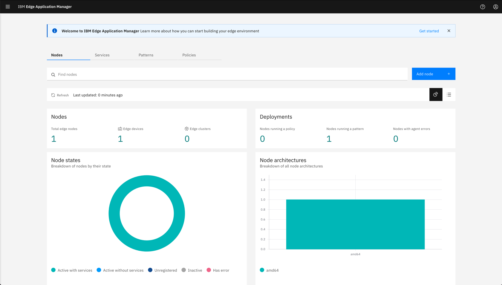

<FeatureCard
  title="Getting Started with IBM Edge Application Manager Trial"
  color="dark"
  >


</FeatureCard>

***

## Prerequisites

  To get started, you need the IBM Edge Application Manager Trial environment. To request one, follow the instructions here: [Requesting the Trial](https://ibm-garage-tsa.github.io/edge-demohub/environment/requesting/)

## Accessing the Trial environment

  There are two elements of the Trial environment:

  - instance of the IBM Edge Application Manager running on IBM Cloud (Management Hub)
  - sample virtual machine simulating the edge device (Edge node)

  When the Trial environment is provisioned, you should receive an e-mail with links and access credentials as shown below.

  

## Accessing the IBM Edge Application Manager management hub

  In the email confirming the Trial reservation, there is a link to the Management hub and your access credentials.

  

  Open the provided link in the browser and you should see the following screen. (The Trial envionment is currently using self-signed certificates so accept any warnings and continue accessing the website)

  

  Click the **Entrprise LDAP** option and login with the credentials from your e-mail.

  Upon successful login, you should see the home screen of the IBM Edge Application Manager

  

***

## Accessing the simulated edge device

  As a part of the Trial experience you are provided with the sample simulated edge device. In case you do not have any real edge devices you can access the provided virtual machine and follow the tutorials.

  

  To access the simulated edge device (the provided Ubuntu VM) you need a terminal with SSH client. On Mac or Linux workstation use a regular terminal, on Windows use Putty.

  Open the terminal on your workstation. Connect to the VM using provided credentials (Username and password are the same for the IEAM management hub and virtual edge device)

  For Mac and Linux

  ```sh
  ssh <Username>@<Edge-Node-IP> 
  ```

  for example:

  ```sh
  ssh 270xx4w3qr@169.47.95.9
  ```

  For Windows use putty.

***

## Running sample commands

  The simulated edge device is automatically registered to the IBM Edge Application Manager hub, and is running a sample pattern. You can start exploring running the following commands:

  ```sh
  hzn node list
  {
    "id": "vm-270xx4w3qr",
    "organization": "270xx4w3qr",
    "pattern": "IBM/pattern-ibm.helloworld",
    "name": "vm-270xx4w3qr",
    "nodeType": "device",
    "token_last_valid_time": "2021-02-01 07:24:31 +0000 UTC",
    "token_valid": true,
    "ha": false,
    "configstate": {
      "state": "configured",
      "last_update_time": "2021-02-01 07:24:31 +0000 UTC"
    },
    "configuration": {
      "exchange_api": "https://cp-console.edgetrials4-3195e5b101a2fc76b9c4875fb79cfa25-0000.us-south.containers.appdomain.cloud/edge-exchange/v1/",
      "exchange_version": "2.54.0",
      "required_minimum_exchange_version": "2.44.0",
      "preferred_exchange_version": "2.44.0",
      "mms_api": "https://cp-console.edgetrials4-3195e5b101a2fc76b9c4875fb79cfa25-0000.us-south.containers.appdomain.cloud/edge-css",
      "architecture": "amd64",
      "horizon_version": "2.27.0-173"
    }
  }

  hzn agreement list
  [
    {
      "name": "pattern-ibm.helloworld_ibm.helloworld_IBM_amd64 merged with pattern-ibm.helloworld_ibm.helloworld_IBM_amd64",
      "current_agreement_id": "e74dde5349b7eab24b4ca48e6933b45324011a3ef98f6683a183aa1d1195b3a9",
      "consumer_id": "IBM/agbot",
      "agreement_creation_time": "2021-02-01 07:24:53 +0000 UTC",
      "agreement_accepted_time": "2021-02-01 07:25:03 +0000 UTC",
      "agreement_finalized_time": "2021-02-01 07:25:03 +0000 UTC",
      "agreement_execution_start_time": "2021-02-01 07:25:06 +0000 UTC",
      "agreement_data_received_time": "",
      "agreement_protocol": "Basic",
      "workload_to_run": {
        "url": "ibm.helloworld",
        "org": "IBM",
        "version": "1.0.0",
        "arch": "amd64"
      }
    }
  ]

  docker ps
  CONTAINER ID   IMAGE                              COMMAND                  CREATED         STATUS         PORTS     NAMES
  26aace4fe9ab   openhorizon/ibm.helloworld_amd64   "/bin/sh -c /service…"   9 minutes ago   Up 9 minutes             e74dde5349b7eab24b4ca48e6933b45324011a3ef98f6683a183aa1d1195b3a9-ibm.helloworld
  ```

  This concludes the **Getting started** tutorial. Please continue with the additional provided tutorials or exlopre on your own, using the product [Knowledge Center](https://www.ibm.com/support/knowledgecenter/pl/SSFKVV_4.2/developing/developing.html).
