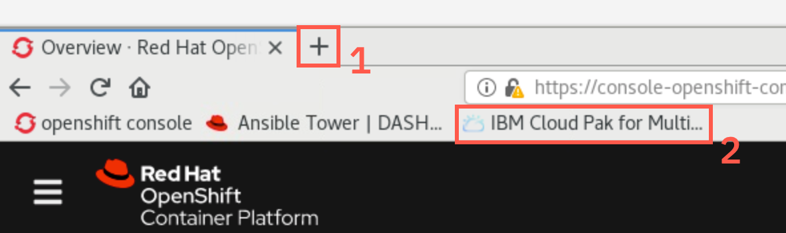
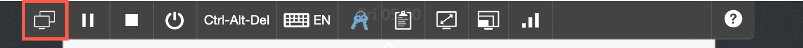

<FeatureCard
  title="Getting Started with Cloud Pak for MCM 2.x demo environment"
  color="dark"
  >


</FeatureCard>

***

This tutorial as well as other linked ones were designed to run using the following environment: [https://bluedemos.com/show/3915](https://bluedemos.com/show/3915) available also throught IBM DTE 2.0 portal [https://dte2.us1a.cirrus.ibm.com/show/3915](https://dte2.us1a.cirrus.ibm.com/show/3915)

## Accessing and starting the environment

When the demo environment is provisioned you should receive the mail with link and access password. Open the link and provide the password. You should see the following screen:


Start the environment with the Play button in the top-right corner


It takes about 10-15 minutes for the environment to start and stabilize

***

## Accessing the desktop

  Click the screen representing the "desktop" VM

  

  You should see the following screen

  

  Click on the screen or hit enter key, then select the **ibmuser**

  

  You can type in password **engageibm** or insert the stored credentials as shown below

  

  You can resize the virtual desktop with the **Fit to window** button

  

  Upon login the browser should start automatically, loading the Openshift console.

  Select **htpasswd**

  

  User **ibmadmin** with the password should be pre-populated for you. Click **Login**

  If the environment initialized properly, you should see the screen similar to the one attached below

  

  Verify the status of the Cluster, Control Plane and Operators (all should have a green mark). There should be **7 Nodes**. If there is more, go to the [Troubleshooting startup](#troubleshooting-environment-startup) section below.

  If you see some hanging pods (number next to the grey icon), you can check for [hanging pods](#some-pods-hangs-on-startup). If you see some number of pods (usually ~20) naxt to red circle **Error** - do not worry - these were failed cron jobs that does not affect the environment.

***

## Opening Cloud Pak for MCM User Interface

  Open the new browser tab with the '+' and select the "IBM Cloud Pak for Multi..." bookmark

  

  On the login screen, select **Enterprise LDAP** and provide the **bob** user with the password **Passw0rd** (you can type the credentials or Insert from the stored credentials in Skytap menu)

  

  

  If the view opens to **IBM Cloud Pak Administration Hub** shown below (due to some cookies left from previous run before the template was captured) - just click the bookmark again.

  

  If everything initializaed properly, you should see the following menus available:

  

  If you cannot see these menus, check if there are any [hanging pods](#some-pods-hangs-on-startup). It is worth waiting another 3-5 minutes and refreshing the browser window (or log out/log in). The environment is massive and it really takes a time to stabilize Kubernetes cluster with 500+ pods running after startup of VMs.

  If you see the menus, environment is ready to start the excercises. If you cannot see just Monitoring menus - don't worry, you can still do most of the labs, while the rest of the environment completes initialization.

  On the desktop (you may need to minimize the browser window to see it), there are two links to the Terminal sessions

  

  One session with the green background and title **Management Hub** connects to the Management cluster (Hub)

  The other session with the yellow backgroun and title **MicroK8s** connects to the managed cluster

  During the excercises pay attention in which window you are supposed to run different commands

***

## Troubleshooting environment startup

***

### Worker node registered as localhost

  Openshift Container Platform was designed for continuous running so starting it from the VM snapshot is not natural behaviour. Sometimes, when the Skytap systems are busy with other workloads it may happen that due to some timeouts in the initialization process one or more of the nodes registers to the control plane as 'localhost' rather then using actual worker node name. If this happens on the Openshift console you can see 8 nodes instead of 7.

  To correct the situation, open the terminal window (link **Terminal** on the desktop), and run the following commands:
  
  ```sh
  ./oclogin.sh
  oc delete node localhost
  ```

  Then, restart the whole environment. To do this, access the Skytap menu, select first icon on the left (**All VMs**) and then use the stop and start buttons in the top right corner.

  

  

***

### Some pods hangs on startup.

  It is also possible that some of the pods won't initializa properly, which is shown on the screenshot below

  

  In such case, click the grey circle to go to the list of misbihaving pods, and delete them manually to force recreation

  
