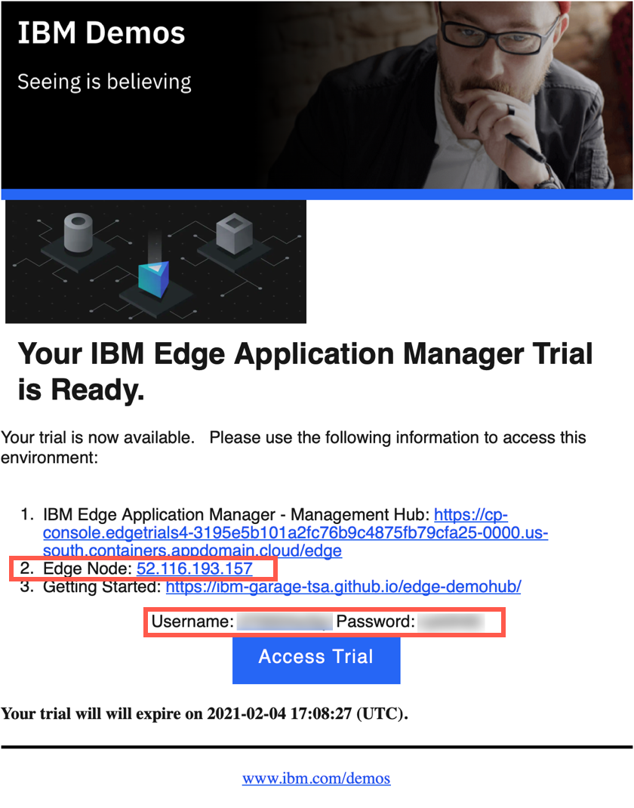
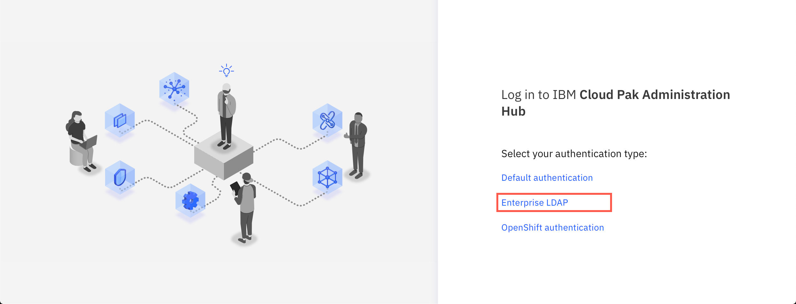
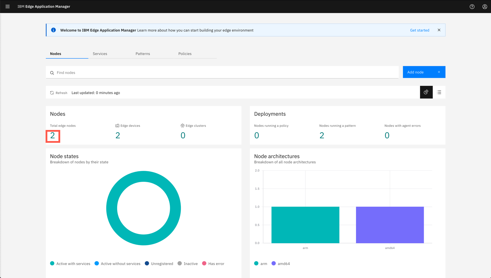
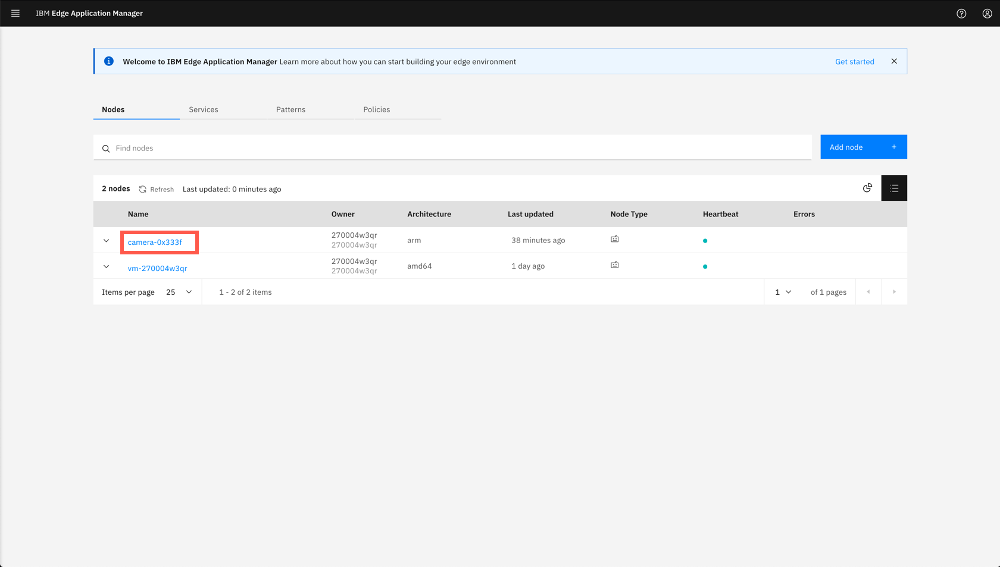
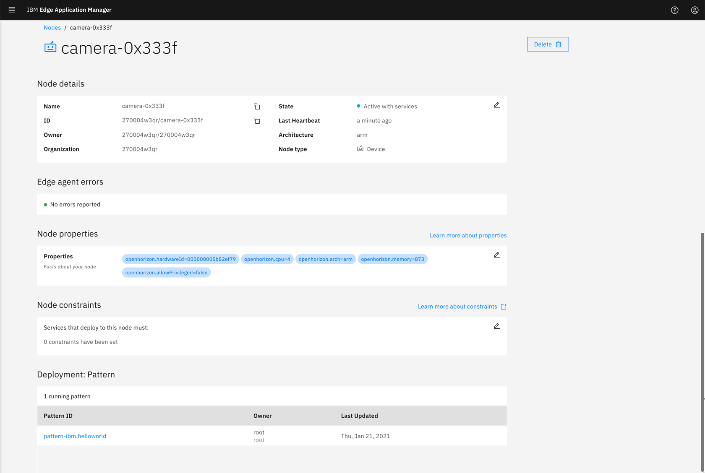

<FeatureCard
  title="Installing the IBM Edge Application Manager agent in edge device"
  color="dark"
  >


</FeatureCard>


<AnchorLinks>
  <AnchorLink>Lab Overview</AnchorLink>
  <AnchorLink>Prerequisites</AnchorLink>
  <AnchorLink>Business Context</AnchorLink>
  <AnchorLink>Connect to the simulated edge device to gather the API key</AnchorLink>
  <AnchorLink>Install the agent on your own edge devices</AnchorLink>
  <AnchorLink>Verify node registration</AnchorLink>
  <AnchorLink>Summary</AnchorLink>
</AnchorLinks>

***

## Lab Overview

  In this tutorial, you will explore the following key capabilities:

  - Understand IBM Edge Application Manager node management
  - Learn how to add and configure edge nodes

***

## Prerequisites

  This tutorial assume that you have already started the Trial environment. If you haven't done it yet, please complete first the [Getting Started tutorial](../gettingstarted/). The simulated edge device has the agent already installed and registered, so the following tutorials is meant to be used with your own edge devices, for example Raspberry Pi.

***

## Business Context

  One of the challenges in managing edge devices is scale - there can be hundreds and thousands of devices installed in your company, in many different locations, often far from the data center. Edge nodes can be also on or off the network, which additionally impairs status visibility.

  There are multiple ways to install agent on the edge device. You can explore these in more details looking at [Knowledge Center](https://www.ibm.com/support/knowledgecenter/SSFKVV_4.2/installing/registration.html).

  You will complete the following tasks:

  - Connect to the edge device using ssh
  -	Create an API key for the edge devices
  -	Install agent on the edge device
  -	Register the edge device with management hub
  - Verify the registration in IBM Edge Application Manager console
  
***

## Connect to the simulated edge device to gather the API key

  To access the simulated edge device (the provided Ubuntu VM) you need a terminal with SSH client. On Mac or Linux workstation use a regular terminal, on Windows use Putty.

  Use credentials provided in the reservation confirmation mail. 

  

  ```sh
  ssh <username>@<edge_node_IP>
  ```

  The API key is located in ```/install/hzn_user_auth_key``` file.

  ```sh
  more /install/hzn_user_auth_key

  iamapikey:Mx_8aO6ZlmZoJVoJoDCDdl8Rdt4YCnOLRSVE2G7pJXYM
  ```
  
***

## Install the agent on your own edge devices

  If you want to manage your own edge devices, you have to register them with the IBM Edge Application Manager management hub. Follow the procedure below to accomplish this.
  
  Connect to your edge device that satisfy the requirements listed in [Knowledge Center](https://www.ibm.com/support/knowledgecenter/pl/SSFKVV_4.2/installing/adding_devices.html).
  
  Run the following commands to install the agent and register it with the IBM Edge Application Manager management hub. 

  ```sh
  export HZN_EXCHANGE_USER_AUTH=<API-key-from-the-steps-above>   [For example: iamapikey:Mx_8aO6ZlmZoJVoJoDCDdl8Rdt4YCnOLRSVE2G7pJXYM ]
  export HZN_ORG_ID=<your-username>
  export HZN_FSS_CSSURL=<ieam-hub-url>/edge-css/

  wget https://raw.githubusercontent.com/open-horizon/anax/master/agent-install/agent-install.sh
  chmod +x ./agent-install.sh
  sudo  ./agent-install.sh -i 'css:' -p IBM/pattern-ibm.helloworld -w '*' -T 120
  ```

  You can verify if the agent installed successfully with the following command:

  ```sh
  hzn node list
  ```

  The output should look similar to the one shown below.

  ```sh
  $ hzn node list
  {
    "id": "camera-0x333f",
    "organization": "270004w3qr",
    "pattern": "IBM/pattern-ibm.helloworld",
    "name": "camera-0x333f",
    "nodeType": "device",
    "token_last_valid_time": "2021-02-03 14:42:47 +0100 CET",
    "token_valid": true,
    "ha": false,
    "configstate": {
      "state": "configured",
      "last_update_time": "2021-02-03 14:42:52 +0100 CET"
    },
    "configuration": {
      "exchange_api": "https://cp-console.edgetrials4-3195e5b101a2fc76b9c4875fb79cfa25-0000.us-south.containers.appdomain.cloud/edge-exchange/v1/",
      "exchange_version": "2.54.0",
      "required_minimum_exchange_version": "2.44.0",
      "preferred_exchange_version": "2.44.0",
      "mms_api": "https://cp-console.edgetrials4-3195e5b101a2fc76b9c4875fb79cfa25-0000.us-south.containers.appdomain.cloud/edge-css",
      "architecture": "arm",
      "horizon_version": "2.27.0-173"
    }
  }
  ```

***

## Verify node registration

  The last step is to verify the device registration in the IBM Edge Application Manager web console. Open the browser on your workstation and connect to the URL provided in the Trial confirmation e-mail.

  Open the provided link in the browser and you should see the following screen (The Trial envionment is currently using self-signed certificates so accept any warnings and cotinue accessing the website)

  

  Click the **Entrprise LDAP** option and login with the credentials from your e-mail.

  Upon successful login, you should see the home screen of the IBM Edge Application Manager

  

  Click the number in the **Nodes** section to see the list. 
  
  
  
  Then click the device id on the list.

  

  You should see the details of your edge device as shown below.

  

***

## Summary

  Congratulations! You have successfully completed the lab "Installing IBM Edge Application Manager agent”. Then node is automatically registered and assigned with the sample pattern. To learn more about deploying sample "helloworld" service visit [Open Horizon GitHub](https://github.com/open-horizon/examples/blob/master/edge/services/helloworld/README.md#horizon-hello-world-example-edge-service).

