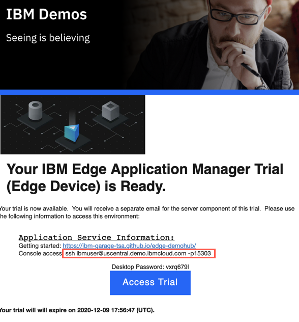
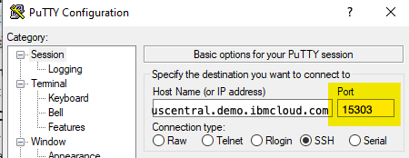
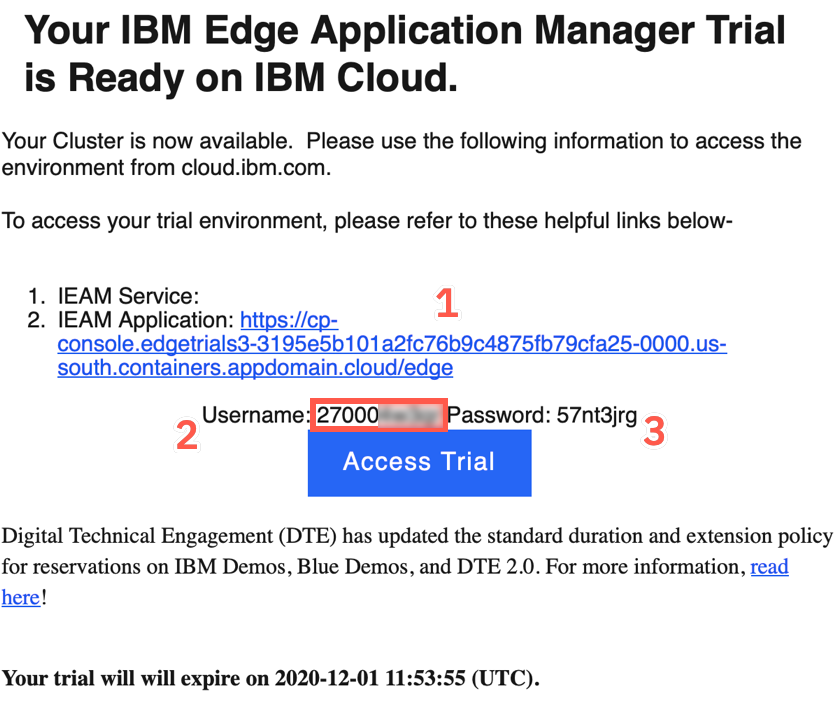
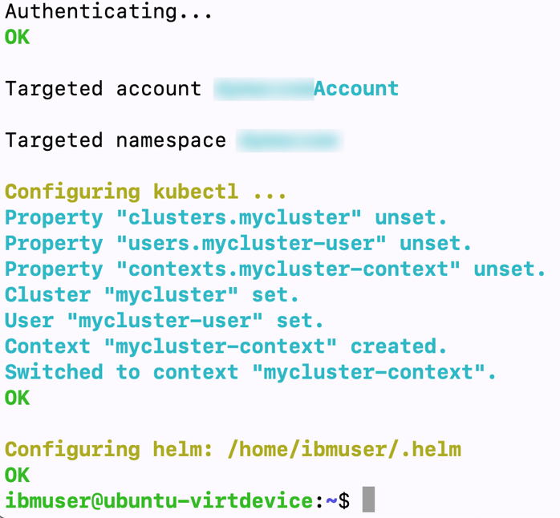
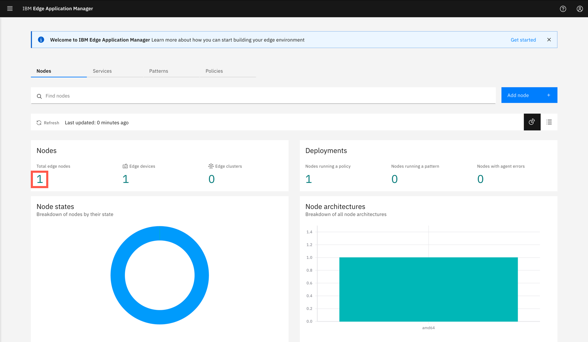
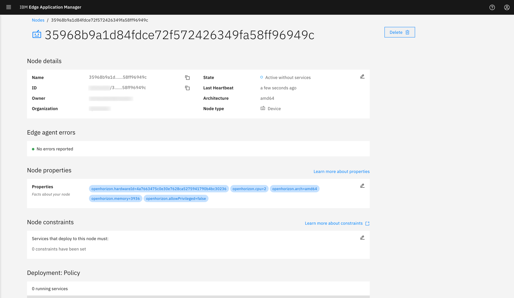

<FeatureCard
  title="Installing the IBM Edge Application Manager agent in edge device"
  color="dark"
  >


</FeatureCard>


<AnchorLinks>
  <AnchorLink>Lab Overview</AnchorLink>
  <AnchorLink>Prerequisites</AnchorLink>
  <AnchorLink>Business Context</AnchorLink>
  <AnchorLink>Connecting to the simulated edge device</AnchorLink>
  <AnchorLink>Create an API key</AnchorLink>
  <AnchorLink>Install the agent on the edge device</AnchorLink>
  <AnchorLink>Register the edge device with management hub</AnchorLink>
  <AnchorLink>Verify the registration</AnchorLink>
  <AnchorLink>Summary</AnchorLink>
</AnchorLinks>

***

## Lab Overview

  In this tutorial, you will explore the following key capabilities:

  - Understand IBM Edge Application Manager node management
  - Learn how to add and configure edge nodes

***

## Prerequisites

  This tutorial assume that you have already started the Trial environment. If you haven't done it yet, please complete first the [Getting Started tutorial](../gettingstarted/)

***

## Business Context

  One of the challenges in managing edge devices is scale - there can be hundreds and thousands of devices installed in your company, in many different locations, often far from the data center. Edge nodes can be also on or off the network, which additionally impairs status visibility.

  There are multiple ways to install agent on the edge device. You can explore these in more details looking at [Knowledge Center](https://www.ibm.com/support/knowledgecenter/SSFKVV_4.2/installing/registration.html).

  You will complete the following tasks:

  - Connect to the edge device using ssh
  -	Create an API key for the edge devices
  -	Install agent on the edge device
  -	Register the edge device with management hub
  - Verify the registration in IBM Edge Application Manager console
  
***

## Connecting to the simulated edge device

  To access the simulated edge device (the provided Ubuntu VM) you need a terminal with SSH client. On Mac or Linux workstation use a regular terminal, on Windows use Putty.

  <span style="color:red">**IT IS NOT RECOMMENDED TO USE SKYTAP UI TO CONNECT TO THE MACHINE - YOU WILL USE A TERMINAL CONNECTION DIRECTLY FROM YOUR WORKSTATION**</span>

  Copy the **ssh** command provided in the reservation confirmation mail. 

  

  In above example, it is **ssh ibmuser@uscentral.demo.ibmcloud.com -p 15303**. It is the SSH port exposed from the virtal machine for your instance.

  Open the terminal on your workstation. Connect to the VM using user **ibmuser** with password **passw0rd!**

  For Mac and Linux
  ```
  ssh -p <port> ibmuser@<address>
  ```

  for example:
  ```
  ssh -p 14078 localuser@services-uscentral.skytap.com
  ```

  For Windows use putty

  

  Upon sucessful login you should see the similar output

  ```sh
  $ ssh ibmuser@services-uscentral.skytap.com -p 13533
  The authenticity of host '[services-uscentral.skytap.com]:13533 ([184.170.232.54]:13533)' can't be established.
  ECDSA key fingerprint is SHA256:Qmebxf1haOx+zzp4gPxpB8EZ4N1YQ3rEcQK+jRj5b/Q.
  Are you sure you want to continue connecting (yes/no/[fingerprint])? yes
  Warning: Permanently added '[services-uscentral.skytap.com]:13533,[184.170.232.54]:13533' (ECDSA) to the list of known hosts.
  ibmuser@services-uscentral.skytap.com's password: 
  Welcome to Ubuntu 18.04.4 LTS (GNU/Linux 5.4.0-47-generic x86_64)

  * Documentation:  https://help.ubuntu.com
  * Management:     https://landscape.canonical.com
  * Support:        https://ubuntu.com/advantage

  * Introducing self-healing high availability clusters in MicroK8s.
    Simple, hardened, Kubernetes for production, from RaspberryPi to DC.

      https://microk8s.io/high-availability

  * Canonical Livepatch is available for installation.
    - Reduce system reboots and improve kernel security. Activate at:
      https://ubuntu.com/livepatch

  0 packages can be updated.
  0 updates are security updates.

  Your Hardware Enablement Stack (HWE) is supported until April 2023.
  Last login: Mon Nov 30 11:58:13 2020 from 1.2.3.4
  ibmuser@ubuntu-virtdevice:~$ 
  ```

***

## Create an API key

  In this section, you will connect to the IBM Edge Application Manager server, generate the API key for your user and use that key to install and register the agent.

  In the Trial confirmation email for management hub, you have received required credential:

  1) URL
  2) Username
  3) Password

  

  For convenience, create the environment variables with these values, so you can copy/paste all following commands without a need to modify them

  ```sh
  export USERNAME=<username>
  export PASSWORD=<password>
  export URL=https://cp-console.edgetrials4-3195e5b101a2fc76b9c4875fb79cfa25-0000.us-south.containers.appdomain.cloud
  ```

  The Username (marked with the red border) is aslo your Organization ID, required to run the commands shown below.

  In the terminal which you used to connect to the edge device, run the following command.

  ```sh
  cloudctl login -a $URL -u $USERNAME -p $PASSWORD -n $USERNAME --skip-ssl-validation
  ```

  The output should be similar to the one shown below.

  

  Upon successful authentication to the hub, run the following commands to create API key that will be used by your edge devices in communication with the hub.

  ```sh
  cloudctl iam api-key-create $USERNAME -d $USERNAME -f $USERNAME.json
  export HZN_EXCHANGE_USER_AUTH=iamapikey:`cat $USERNAME.json | jq -r .apikey`
  export HZN_ORG_ID=$USERNAME
  ```

## Install the agent on the edge device

  The required binaries are already downloaded to the virtual machine. Run the following commands to install the agent and register it with the IBM Edge Application Manager management hub.

  ```sh
  cd agent
  ./agentinstall.sh
  ```

  You can verify if the agent installed successfully with the following command:

  ```sh
  hzn node list
  ```

  The output should look similar to the one shown below.

  ```sh
  ibmuser@ubuntu-virtdevice:~/agent$ hzn node list
  {
    "id": "",
    "organization": null,
    "pattern": null,
    "name": null,
    "nodeType": null,
    "token_last_valid_time": "",
    "token_valid": null,
    "ha": null,
    "configstate": {
      "state": "unconfigured",
      "last_update_time": ""
    },
    "configuration": {
      "exchange_api": "https://cp-console.edgetrials4-3195e5b101a2fc76b9c4875fb79cfa25-0000.us-south.containers.appdomain.cloud/edge-exchange/v1/",
      "exchange_version": "2.54.0",
      "required_minimum_exchange_version": "2.44.0",
      "preferred_exchange_version": "2.44.0",
      "mms_api": "https://cp-console.edgetrials4-3195e5b101a2fc76b9c4875fb79cfa25-0000.us-south.containers.appdomain.cloud/edge-css",
      "architecture": "amd64",
      "horizon_version": "2.27.0-173"
    }
  }
  ```

***

## Register the edge device with management hub

  In this step you register the edge device with the management hub. To accomplish that run, the following commands in the terminal connected to your edge device:

  ```sh
  hzn register
  ```

  The output should look similar to the one shown below.

  ```sh
  Horizon Exchange base URL: https://cp-console.edgetrials4-3195e5b101a2fc76b9c4875fb79cfa25-0000.us-south.containers.appdomain.cloud/edge-exchange/v1
  Generated random node ID: 35968b9a1d84fdce72f572426349fa58ff96949c.
  Generated random node token
  Node dymaczew/35968b9a1d84fdce72f572426349fa58ff96949c does not exist in the Exchange with the specified token, creating/updating it...
  node added or updated
  Node 35968b9a1d84fdce72f572426349fa58ff96949c created.
  No pattern or node policy is specified. Will proceeed with the existing node policy.
  Initializing the Horizon node with node type 'device'...
  Note: no input file was specified. This is only valid if none of the services need variables set.
  However, if there is 'userInput' specified in the node already in the Exchange, the userInput will be used.
  Changing Horizon state to configured to register this node with Horizon...
  Horizon node is registered. Workload agreement negotiation should begin shortly. Run 'hzn agreement list' to view.
  ```

  You can run the `hzn node list` command and compare the output. This time you should see the **"state": "configured"**

***

## Verify the registration

  The last step is to verify the device registration in the IBM Edge Application Manager web console. Open the browser on your workstation and connect to the URL provided in the Trial confirmation e-mail.

  Open the provided link in the browser and you should see the following screen (The Trial envionment is currently using self-signed certificates so accept any warnings and cotinue accessing the website)

  

  Click the **Entrprise LDAP** option and login with the credentials from your e-mail.

  Upon successful login, you should see the home screen of the IBM Edge Application Manager

  

  Click the number in the **Nodes** section to see the list. Then click the device id. You should see the details of your edge device as shown below.

  

***

## Summary

  Congratulations! You have successfully completed the lab "Installing IBM Edge Application Manager agent”. To deploy sample "helloworld" service visit [Open Horizon GitHub](https://github.com/open-horizon/examples/blob/master/edge/services/helloworld/README.md#horizon-hello-world-example-edge-service).

