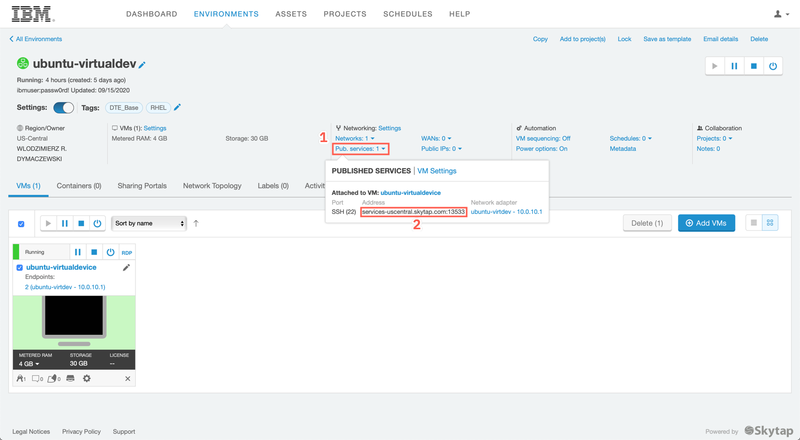

<FeatureCard
  title="Installing the IBM Edge Application Manager agent in edge device"
  color="dark"
  >


</FeatureCard>


<AnchorLinks>
  <AnchorLink>Lab Overview</AnchorLink>
  <AnchorLink>Prerequisite</AnchorLink>
  <AnchorLink>Business Context</AnchorLink>
  <AnchorLink>Create API key</AnchorLink>
  <AnchorLink>Install the agent</AnchorLink>
  <AnchorLink>Summary</AnchorLink>
</AnchorLinks>

***

## Lab Overview

IBM Cloud Pak for Multicloud Management provides consistent visibility, automation, and governance across a range of multicloud management capabilities such as cost and asset management, infrastructure management, application management, multi-cluster management, edge management, and integration with existing tools and processes. Customers can leverage Cloud Pak for Multicloud Management to simplify their IT and application ops management, while increasing flexibility and cost savings with intelligent data analysis driven by predictive signals.

IBM Cloud Pak for Multicloud Management can manage Kubernetes clusters that are deployed on any target infrastructure - either in your own data center or in a public cloud.

In this tutorial, you will explore the following key capabilities:
-	`Understand Cloud Pak for Multicloud Management`
-	`Learn how to add a managed cluster`
- `learn how to gather monitoring metrics from the managed cluster`
-	`Learn how to deploy an application to the managed cluster`

***

## Prerequisite

- You need to provision your own copy of the CP4MCM 2.0 environment, start it and verify for correct startup (check [here](../../gettingstarted/)).

***

## Business Context

As a member of the Cloud Operation team, you are having problems to manage your multicloud hybrid world. Operate your cloud-based services and data across multiple providers is overwhelming your team.
Your company is deploying multiple Kubernetes clusters to address their specific needs. Some Dev teams are deploying clusters across public and private clouds, and some are deploying clusters across regions, and some are deploying clusters to support the development and test needs.

As different teams deploy more clusters, new challenges are introduced:
-	Where are my services running?
-	How can I monitor applications across clusters and clouds?
-	How can I manage clusters as if they were one environment?
-	Where are the failed components?
-	How do I deploy applications across these environments?
-	How do I move workloads across environments?
-	How do I set consistent security policies across environments?
-	Which clusters are compliant?
-	How can I place workloads based on capacity, policy?

Because of that, you want to explore how IBM Cloud Pak for Multicloud Management, provides consistent visibility, governance and automation of your complex environment.

In this tutorial, you use a Red Hat OpenShift cluster with Cloud Pak for MCM as a **Management Hub** and a second single-node cluster running MicroK8s as a **managed cluster**
-	Hub cluster includes management console, federated monitoring, and all the controllers. 
-	Managed cluster includes klusterlet components that communicate status back to the Hub cluster. 

The relationship between hub and managed clusters is shown in the diagram below:


In this tutorial, you will log in to the Hub cluster to do cluster management.

You will complete the following tasks:
-	Add a managed cluster
-	Visualize cluster topology
-	Visualize clusters and launch to each cluster
- Deploy remote cluster cloud native monitoring
-	Deploy an application to remote cluster
-	Manage cluster objects

***

## Connecting to the simulated edge device

To access the simulated edge device (the provided Ubuntu VM) you need a terminal with SSH client. On Mac or Linux workstation use a regular terminal, on Windows use Putty

Open the link provided you in the reservation confirmation mail. You should see the similar similar to the one shown below:

<span style="color:red">**IT IS NOT RECOMMENDED TO USE SKYTAP UI TO CONNECT TO THE MACHINE - YOU WILL USE A TERMINAL CONNECTION DIRECTLY FROM YOUR WORKSTATION**</span>

You should see the page that looks like this



Take a note of address and the port number, next to the **ubuntu-virtualdev** VM. In above example, it is *services-uscentral.skytap.com* and *13533*. It is the SSH port exposed from the virtal machine for your instance.

Open the terminal on your workstation. Connect to the VM using user **ibmuser** with password **passw0rd!**

For Mac and Linux
```
ssh -p <port> ibmuser@<address>
```

for example:
```
ssh -p 14078 localuser@services-uscentral.skytap.com
```

For Windows use putty


Upon sucessful login you should see the similar output

```sh
$ ssh ibmuser@services-uscentral.skytap.com -p 13533
The authenticity of host '[services-uscentral.skytap.com]:13533 ([184.170.232.54]:13533)' can't be established.
ECDSA key fingerprint is SHA256:Qmebxf1haOx+zzp4gPxpB8EZ4N1YQ3rEcQK+jRj5b/Q.
Are you sure you want to continue connecting (yes/no/[fingerprint])? yes
Warning: Permanently added '[services-uscentral.skytap.com]:13533,[184.170.232.54]:13533' (ECDSA) to the list of known hosts.
ibmuser@services-uscentral.skytap.com's password: 
Welcome to Ubuntu 18.04.4 LTS (GNU/Linux 5.4.0-47-generic x86_64)

 * Documentation:  https://help.ubuntu.com
 * Management:     https://landscape.canonical.com
 * Support:        https://ubuntu.com/advantage

 * Introducing self-healing high availability clusters in MicroK8s.
   Simple, hardened, Kubernetes for production, from RaspberryPi to DC.

     https://microk8s.io/high-availability

 * Canonical Livepatch is available for installation.
   - Reduce system reboots and improve kernel security. Activate at:
     https://ubuntu.com/livepatch

0 packages can be updated.
0 updates are security updates.

Your Hardware Enablement Stack (HWE) is supported until April 2023.
Last login: Mon Nov 30 11:58:13 2020 from 76.230.154.218
ibmuser@ubuntu-virtdevice:~$ 
```

***

## Add API key

In this section, you will connect to the IBM Edge Application Manager server, generate the API key for your user and use that key to install and register the agent.


  Congratulations! You have successfully completed the lab "Installing IBM Edge Application Manager agent”.

***

## Summary

You completed the Cloud Pak for Multicloud Management tutorial: Multi-cluster Management. Throughout the tutorial, you explored the key takeaways:
- `Understand Cloud Pak for Multicloud Management`;
- `Add a managed cluster`;
- `Deploy an application`;
-	`Manage and monitor application resources of local and remote clusters`;

If you would like to learn more about Cloud Pak for Multicloud Management, please refer to:
-	<a href="https://www.ibm.com/cloud/cloud-pak-for-management" target="blank">Cloud Pak for Multicloud Management home page</a>
- <a href="https://www.ibm.com/demos/collection/Cloud-Pak-for-Multicloud-Management" target="blank">Cloud Pak for Multicloud Management Demos </a>
