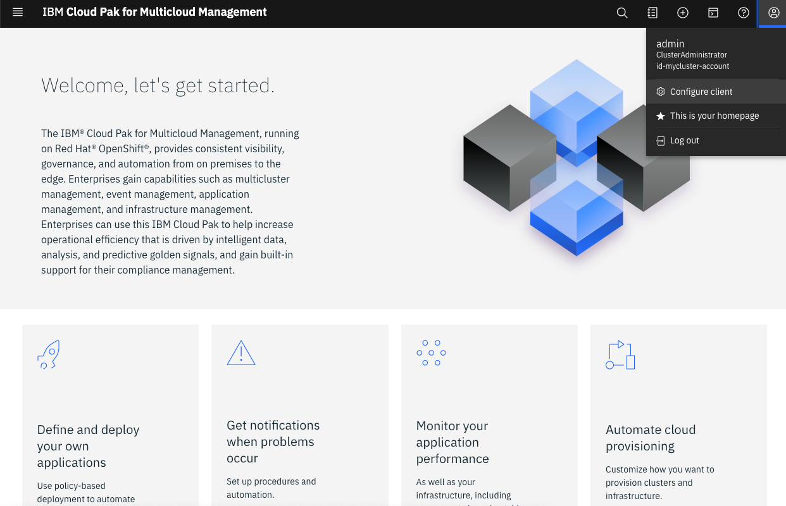

<PageDescription>

Now let's see how to configure contexts to access your Clusters.

</PageDescription>

<AnchorLinks>
  <AnchorLink>Configuring your ROKS Hub Cluster context</AnchorLink>
  <AnchorLink>Configuring your ROKS Managed Cluster context</AnchorLink>
  <AnchorLink>(Optional) Configuring your IKS Cluster context</AnchorLink>
</AnchorLinks>

***

## Configuring your ROKS Hub Cluster context

1.Back to the Cloud Pak for Multicloud Management Web Console (if you are not there, check [here](../beforestart/) how to open your console page).

  

2.Select the **user icon**, then click **Configure client**.

  

3.The cluster configuration details display and resemble the client configuration code. Copy and paste the configuration information to your command line, and press Enter.

  

  

4.Check the Kubernetes contexts available, running the command below:

```
kubectl config get-contexts
```

  You should have a mycluster-context that point to your ROKS Hub cluster.

  

  Next step, you will rename this context to simplify how you interact with your ROKS Hub server during our lab.

5.Rename your context, running the command below:

```
kubectl config rename-context mycluster-context roks-hub-cluster
```

6.Now, let's set the current Kubernetes context
```
kubectl config use-context roks-hub-cluster
```

  >Note: Anytime that you want to connect to your ROKS Hub cluster, you just need to run the command above.

7.Let's test the new context configuration. Run the command below to get the cluster nodes.
```
oc get nodes
```

  

  Great, your ROKS Hub cluster is configured and ready to use.

***

## Configuring your ROKS Managed Cluster context

1.Back to the OpenShift Managed Cluster Web Console (if you are not there, you should have an email with a link to OpenShift Console, you received this e-mail when you requested the environment. Note: it is the email about the Cloud Pak Apps cluster not the initial one about Management Pak).

  

2.On the top right of the screen, click on your **username** and select **Copy Login Command**.

  

3.On the new page, click **Display Token**.

  

4.**Copy** the log in command.

  

5.Back to the Terminal window, **paste** and **run** the login command.

  

  The OC login command, created a specific Kubernetes context to your Managed cluster. Let's check it!

6.Check the Kubernetes contexts available, running the command below:

```
kubectl config get-contexts
```

  You should have a new current context that point to your ROKS Managed cluster.

  

  Next step, you will rename this context to simplify how you interact with your ROKS Managed server during our lab. Copy the full name of your current context (default/...).


5.Rename your context, running the command below:

```
kubectl config rename-context <default_context/full_name> roks-managed-cluster
```

6.Now, let's set the current Kubernetes context
```
kubectl config use-context roks-managed-cluster
```

  >Note: Anytime that you want to connect to your ROKS Managed cluster, you just need to run the command above.

7.Let's test the new context configuration. Run the command below to get the cluster nodes.
```
oc get nodes
```

  

  Great, your ROKS Managed cluster is configured and ready to use.

***

## (Optional) Configuring your IKS Cluster context

> There is a known issue to import IKS Kubernetes 1.16 on CP4MCM 1.3.1. Because of that we are not using IKS in the lab yet, but we are working to solve it and it will be available soon!

1.Back to the [IBM Cloud Dashboard page](https://cloud.ibm.com/).

  

2.Confirm that you are using your personal account (account with your name), not the DTE account.

  

3.On IBM Cloud Dashboard, click **Clusters** to see your IKS Free Cluster.

  

4.Click the IKS Free cluster to open the cluster view.

  

5.To configure your CLI to access this cluster, you will need the cluster name, take note of it.

  

6.Back to the Terminal window, if you are not logged in IBM Cloud CLI, go ahead and log in using your IBM Cloud API Key (check IBM Cloud CLI section on [Install CLI Tools page](../installcli) to know how to create an API key)

```
ibmcloud login --apikey @myic.key -r us-south -g default -c <your_ibm_id>
```

7.Set the Kubernetes context to your cluster for this terminal session.
```
ibmcloud ks cluster config --cluster mycluster-free
```

  

8.Check the Kubernetes context available, running the command below:

```
kubectl config get-contexts
```

  You should have a mycluster-free that point to your IKS cluster.

  

  Next step, you will rename this context to simplify how you interact with your IKS server during our lab. Copy the full name of your mycluster-free context.

9.Rename your context, running the command below:

```
kubectl config rename-context <mycluster-free/full_name> iks-free-cluster
```

10.Now, let's set the current Kubernetes context
```
kubectl config use-context iks-free-cluster
```

  >Note: Anytime that you want to connect to your IKS Free cluster, you just need to run the command above.

11.Let's test the new context configuration. Run the command below to get the cluster nodes.
```
kubectl get nodes
```

  

  Great, your IKS cluster is configured and ready to use.
