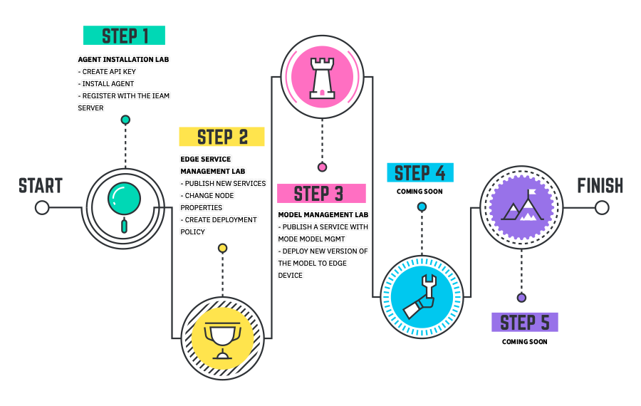

Do you want to learn more about IBM Edge Application Manager? This is the right place. In the following sections, you will have hands-on experience with IBM Edge Application Manager. To complete the labs, you will use your IBM Edge Application Manager Trial.

By now, there are three hands-on labs: Agent Installation, Edge Service Management and Model Management.

We recommend to follow the sequence above, however if you want to explore one specific lab, you can do it, just check the lab prerequisites section before start.
