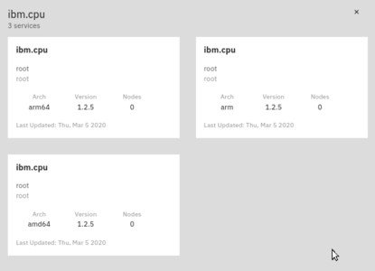

<FeatureCard
  title="Managing edge services with the IBM Edge Application Manager"
  color="dark"
  >


</FeatureCard>


<AnchorLinks>
  <AnchorLink>Lab Overview</AnchorLink>
  <AnchorLink>Prerequisites</AnchorLink>
  <AnchorLink>Business Context</AnchorLink>
  <AnchorLink>Scenario Introduction</AnchorLink>
  <AnchorLink>Registering the edge-device as "smartcart"</AnchorLink>
  <AnchorLink>Working with services</AnchorLink>
  <AnchorLink>Registering the edge-device as "smartscale"</AnchorLink>
  <AnchorLink>Summary</AnchorLink>
</AnchorLinks>

***

## Lab Overview

    IBM Cloud Pak for Multicloud Management provides consistent visibility, automation, and governance across a range of multicloud management capabilities such as cost and asset management, infrastructure management, application management, multi-cluster management, edge management, and integration with existing tools and processes. Customers can leverage Cloud Pak for Multicloud Management to simplify their IT and application ops management, while increasing flexibility and cost savings with intelligent data analysis driven by predictive signals.

    IBM Cloud Pak for Multicloud Management can manage Kubernetes clusters that are deployed on any target infrastructure - either in your own data center or in a public cloud.

    In this tutorial, you will explore the following key capabilities:

    - Understand IBM Edge Application Manager
    - Learn how to add and configure edge nodes
    - Learn how to register a new edge workloads (services)
    - Learn how to enable autonomous management with policies

***

## Prerequisites

This tutorial assume that you have already installed agent on edge device and registered the node to the IBM Edge Application Manager management hub. If you haven't done it yet, please complete first the [Installing IEAM agent tutorial](../agentmgmt/)

***

## Business Context

  Edge computing combined with 5G creates tremendous opportunities for new products, platforms, and experiences in every industry. Edge brings computation and data storage closer to where data is created by people, places and things - to enable faster insights and actions, reduce data exposure and maintain continuous operations. By 2025, 75 percent of enterprise data will be processed at the Edge, compared to only 10 percent today. IBM extends cloud computing to the Edge, with autonomous management capabilities that address new challenges of massive scale, variability, and rate of change - in enterprises and in telcos. [IBM Edge Application Manager](https://www.ibm.com/cloud/edge-application-manager) runs on Red Hat OpenShift, the leading open hybrid multicloud platform that runs anywhere - from any data center, to multiple clouds, to the edge.

***

## Scenario Introduction

    ACME Grocery wants to deliver a new user experience in their stores.

    ACME Grocery is a retail chain that recently started a project to modernize its stores to enhance customer experience and achieve cost savings adopting some of the modern AI-based technologies. In the first phase of the project, the retail chain is deploying smart devices in its locations distributed across the country.

    There are two types of devices to be managed:

    - **Smart shopping carts** (also known aa "smartcarts")

    - **Smart scales** for weighting unpackaged goods, which automatically
        detect what is being weighted to apply correct price (smart camera
        with AI-based visual recognition)

    In this scenario, you are the Operations team engineer responsible for managing the smart devices at scale.

***

## Publish edge services

  To start deploying workloads to edge devices you have to first define the services in the IBM Edge Application Manager management hub. The detailed instructions are available in the [Knowledge Center](https://www.ibm.com/support/knowledgecenter/pl/SSFKVV_4.2/developing/developing_edge_services.html). For the following lab, you can use the shortened version using the files prepared for you in the GitHub respository and sample docker images already published to the DockerHub.

  If you restarted SSH connection after performing agent installation lab, setup the required environment variables ($USERNAME refers to your user in the IBM Edge Application Manager web console)

  ```sh
  cd
  export HZN_EXCHANGE_USER_AUTH=iamapikey:`cat $USERNAME.json | jq -r .apikey`
  export HZN_ORG_ID=$USERNAME
  ```

  To start deploying actual workloads to the edge device you need to register it with the properties of the target device. Let's start with the "smartcart" type. The files needed for further exercises are available in the GitHub repository. To collect the latest version of the files, run the following commands

  ```sh
  cd  
  git clone https://github.com/dymaczew/edge-demo.git
  cd edge-demo
  ```

  To publish a service you have to first create the signing key. This key will be used to ensure the service origination and will prevent tampering or unathorized modifications to service metadata.

  The repository that you have copied above contains the definitions of multiple services and a script that will automate the process. To run the script issue the following command in the terminal windows connected to your edge device:

  ```sh
  publish-services.sh
  ```

  
***

## Registering the edge-device as "smartcart"

  1. Node properties can be defined in the Web cosnole of IBM Edge Application Manager, however this approach is not practical to manage devices at scale. In the following exercise you will use a scripted approach leveraging the Horizon CLI. To change the node type and node properties uzing the `hzn` command, you need to first unregister the device from the IBM Edge Application Manager server. This activity is done usually only in the development and testing phase. In real life, the physical edge devices get their configuration during the initial install process.

     To unregister device run the following command in the Terminal window opened on "edge-device" virtual machine

     ```sh
     hzn unregister -r -f
     ```

  2. To define the node as "smartcart" you need to specify the node properties and constraints during registration. This is done using a JSON file containing the node policy. The sample file was already prepared for you. List the content of the file with the following command:

     ```sh
     cat ~/edge-demo/smartcart/smartcart-node-registration.json
     ```

     Output will look like:

     ```sh
     {
       "properties": [
         {
           "name": "smartcart",
           "value": true
         },
         {
           "name": "location",
           "value": "3801 S Las Vegas Blvd, NV 89109, USA"
         },
         {
           "name": "type",
           "value": "SmartCart1"
         }
       ],
       "constraints": [
         "purpose == battery-monitor OR purpose == content-monitor"
       ]
     }
     ```

  3. To register the node, run the following command

     ```sh
     hzn register --policy=/home/ibmuser/edge-demo/smartcart/smartcart-node-registration.json
     ```

     Output should look like below:

     ```text
     Horizon Exchange base URL: https://cp-console.edgetrials4-3195e5b101a2fc76b9c4875fb79cfa25-0000.us-south.containers.appdomain.cloud/edge-exchange/v1
     Generated random node ID: 1b647860a6de82ff69e1c89695ca18a82aee0089.
     Generated random node token
     Node dymaczew/1b647860a6de82ff69e1c89695ca18a82aee0089 does not exist in the Exchange with the specified token, creating/updating it...
     node added or updated
     Node 1b647860a6de82ff69e1c89695ca18a82aee0089 created.
     Will proceeed with the given node policy.
     Updating the node policy...
     Initializing the Horizon node with node type 'device'...
     Note: no input file was specified. This is only valid if none of the services need variables set.
     However, if there is 'userInput' specified in the node already in the Exchange, the userInput will be used.
     Changing Horizon state to configured to register this node with Horizon...
     Horizon node is registered. Workload agreement negotiation should begin shortly. Run 'hzn agreement list' to view
     ```

1. Let's look back at the IBM Edge Application Manager console. After 1-2 minutes, when you refresh the Nodes view you should see the following view


You can run the "hzn agreement list" and "docker ps" commands in the Terminal window again to verify that the services were actually started at the device.

### Working with services

Services represent the software that is being deployed on the edge - they represent specific functions that you install on the managed devices. There are specialized services, like contentmonitor service that reads the NFC sensor installed in the smart shopping cart to control the value of the goods put in the basket. There are more generic ones. For example, to monitor if the CPU on the edge device is not overloaded with other workloads.

Let's look at the services defined in the environment and check their requirements

1.  Open the Service tab in the IBM Edge Application Manager interface (go back to the Nodes tab with the Nodes link in the top-left corner and then select the **Services** tab)

2.  Notice there are many different services owned by different users. Each version of the service represents a specific version of the Docker container to be running on the edge nodes. Click the '**ibm.cpu**' service.


You can see that this utility service designed to monitor CPU load is available for different processor architectures: arm, arm64, and amd64 (x86_64).



This service can be installed on the devices to control that the other services that use compute-intensive machine learning models do not overload the device.

3.  Click the search box (**Find services**), select the "**Service ID**" as the filter and type **battery** to find the service that is currently running on the edge device.


4.  Click the service tile (**battery-service**) to see the details of the service definition.


5.  Look at the service properties and constraints. Notice there is a "battery-monitor-deployment" policy in Deployment section.


This view provides you with the information where the service potentially can be deployed (for example, how much memory is needed and so on), and list the policies that already govern the deployment of this service to devices.

6.  Similarly, you can find the other service that runs on your smart cart device. Click the **Services** link in the top-left corner to go back to the Services tab, find the service named **smartcart-service** (you should already know how to use Search field) and open the details for it.
7.  It seems the applications designed to be placed on the smartcart devices are working OK. Let\'s check what happens if you register test device as smart scale

### Register a node as smartscale

In this section, you will register the test device as a smart scale to check if the services meant to be running at this type of device are properly defined. Since you have done many of the actions before are providing just a brief instruction.

Steps

1.  Unregister the edge node.

2.  Register the edge node again using the /home/localuser/edge-demo/smartscale/smartscale-node-registration.json file

3.  Check the agreements and docker containers running at the edge device (be patient - it can take 1-2 minutes for the agreement to be negotiated and workload to be placed on the node)

4.  You can notice that now only one service is running on the device. Do you know why? Let's check why the "acmegrocery/smartcart-service_1.0.0_amd64" is not being deployed.

5.  Run the following in the Terminal window

```shell
hzn deploycheck policy -b "acmegrocery/smartcart-v1-deployment"
```

You should see the following output:

```shell
Neither node id nor node policy is specified. Getting node policy fro m the local node. {

\"compatible\": false,

\"reason\": {

\"acmegrocery/smartcartservice\_1.0.0\_amd64\": \"Policy Incompatible:
Compatibility Error: Node properties do not satisfy constraint
requirements. The required properties smartcart==true were not found
in the available properties smartscale=true,
location=Fresh\_Vegetables, type=SmartScale-Video-An alytics-1000,
openhorizon.hardwareId=1c684047a8a3607c04fd409e4d02f1ad 96471d6f,
openhorizon.cpu=4, openhorizon.arch=amd64, openhorizon.memo ry=3951,
openhorizon.allowPrivileged=false\" }

}
```

When working with the IBM Edge Application Manager this command helps you find out if the policies that you define are compatible with the nodes registered in the system.

### Defining a new deployment policy

Let's now define a new deployment policy that will distributes software that should be deployed to smart scale devices. In this exercise, you learn how to effectively use the mechanism of properties and constraints to get the right software to the right devices in an autonomous fashion.

Steps

1.  In the IBM Edge Application Manager interface, find the service named "smartscale-service". Open the details for the service

2.  You can notice that there is no deployment policy defined for that service. Let's create one. Click **Create deployment policy**.


3.  Provide the policy name and description. Notice that the service name and version are already defined, as you initiated the policy creation from the service context. Click **Next** to proceed.


4.  In the second step you need to define which devices should be targeted for deployment. You can use any of the properties defined for the edge nodes. For the scenario let's use the "smartscale" "is equal" "true". Enter the values and click **Next**.


5.  You don't need to change anything on the Advance settings tab, so just click **Next** and then in the Summary page click **Deploy service**


6.  Let's verify that the service was successfully deployed. Go back to termial window (or open new one using the shortcut on the desktop) and check the agreements and running containers. (If you forgot how to do this, look back to the step 4 in **Registering the edgedevice as "smartcart"** section above).

You can also verify the results in UI, looking at the details of edge-device node


Congratulations! Your deployment policy is working! Any new smartscale device connected to the IBM Edge Application Manager hub will get the service deployed automatically.

### Summary

ACME Grocery is ready to start with the rollout of smart devices to the stores. Great job! If you want to explore more advanced functionalities of IBM Edge Application Manager, try the following resources:

<ul>
	<li><a href="https://www.ibm.com/cloud/blog/models-deployed-at-the-edge">Blog on Machine Learning model management at the edge</a></li>
	<li><a href="https://github.com/open-horizon/examples/tree/master/edge/services/helloMMS">Tutorial to play with helloMMS example</a></li>
	<li><a href="https://www.ibm.com/support/knowledgecenter/pl/SSFKVV_4.0/devices/developing/developing.html">Developing edge services with IBM Edge Application Manager</a></li>
</ul>
